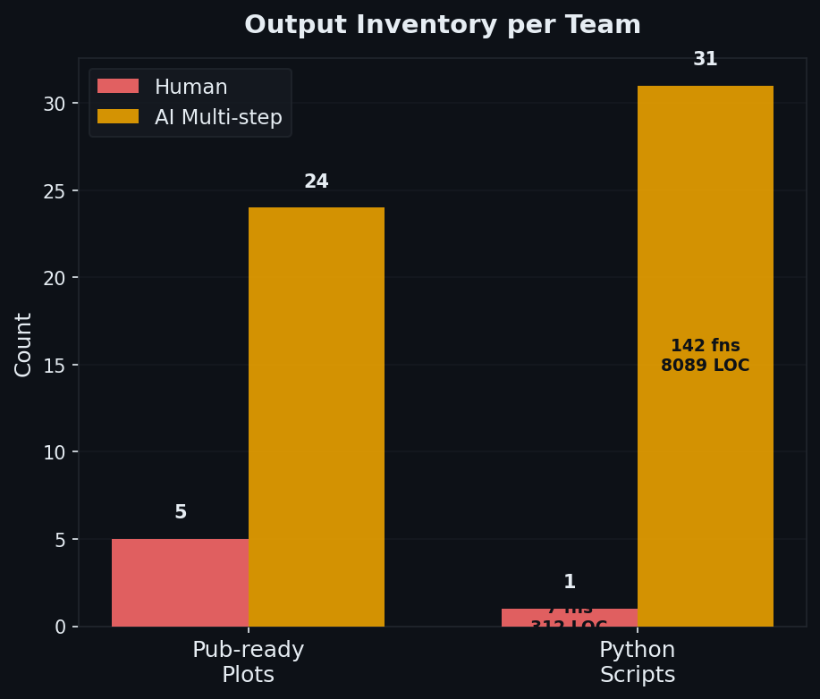
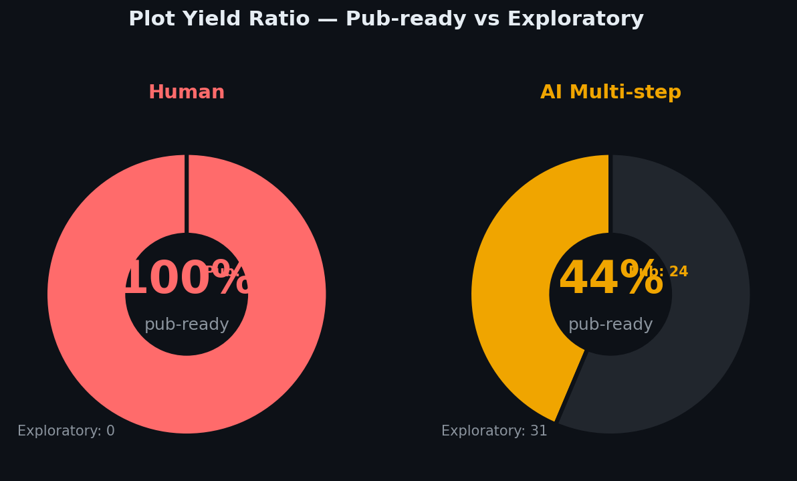
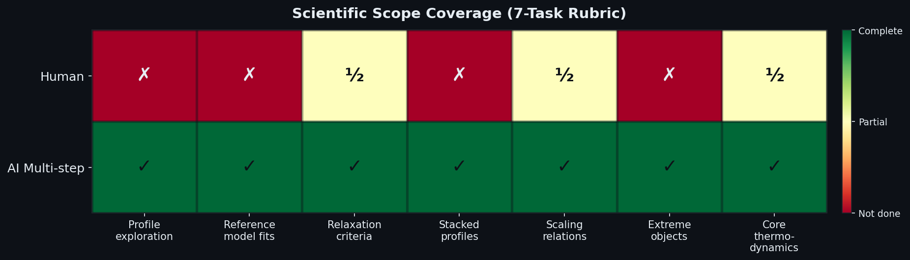
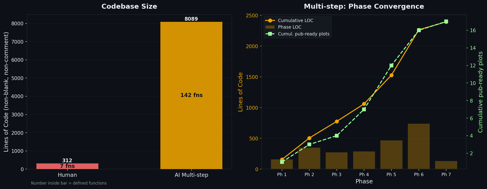
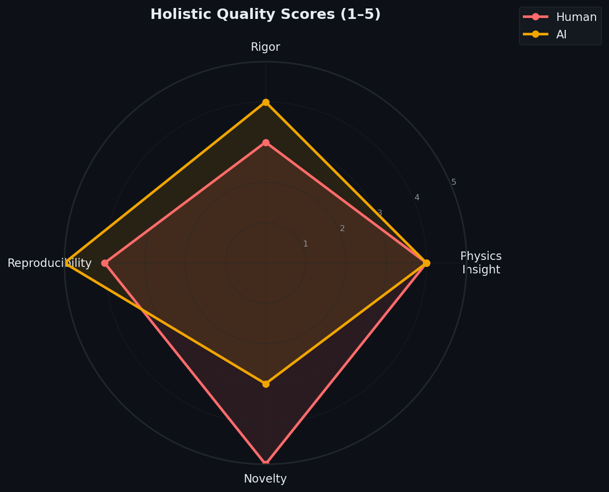
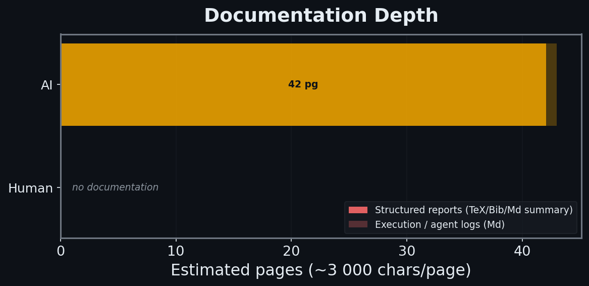
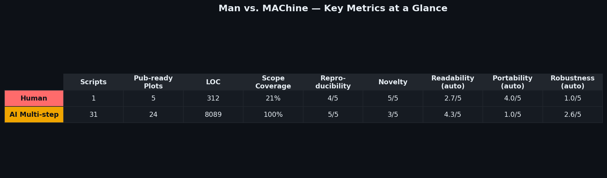
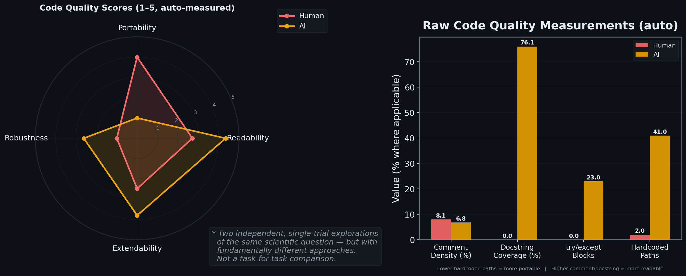

# Man vs. MAChine — Visual Report

**Task:** Multi-criterion galaxy cluster relaxation study · Frontier-E HACC · ~10,000 halos at z=0
**Paradigms:** Human expert · AI single-step (prescriptive 7-step prompt) · AI multi-step (2-sentence vague prompt)
**Current run:** Human vs. AI Multi-step

---

## 1. Output Inventory

Counts of publication-ready plots and saved Python scripts per team.
LOC and function count are annotated inside the script bar.

---

## 2. Plot Yield Ratio

$$\text{Yield} = \frac{N_\text{pub-ready}}{N_\text{total plots}}$$

A plot is **pub-ready** if it shows population-level analysis (stacked profiles, histograms, scaling relations).
**Exploratory** = individual-halo diagnostics, spatial maps, video previews — identified by filename pattern matching.

---

## 3. Scientific Scope Coverage

Each of 7 canonical tasks scored by a domain expert:

| Score | Meaning |
|---|---|
| ✓ `1.0` | Completed with correct methodology and saved outputs |
| ½ `0.5` | Attempted but incomplete or methodologically partial |
| ✗ `0.0` | Not attempted |

Evidence for every cell is cited in `compare.py::RUBRIC` (specific output filenames).

---

## 4. Codebase Size & Multi-step Convergence

**Left:** total LOC (non-blank, non-comment lines via AST) and function count per team.
**Right:** per-phase LOC written (bars) and cumulative pub-ready plots produced (green line) for the AI multi-step team. Shows where scientific value concentrates across phases.

---

## 5. Holistic Quality (Expert-scored, 1–5)

Four dimensions, scored by a domain expert with rationale in `compare.py::HOLISTIC_SCORES`:

| Dimension | What earns a 5 |
|---|---|
| **Physics Insight** | Discordant objects explained, caveats acknowledged, results tied to literature |
| **Rigor** | Percentile bands on all profiles, scatter quantified, thresholds cited from literature |
| **Reproducibility** | Saved scripts + intermediate data outputs, no broken paths, pipeline re-runnable end-to-end |
| **Novelty** | Original criteria / diagnostics not present in the prompt |

---

## 6. Documentation Depth

Character count of structured reports (`.tex`, `.bib`) and agent logs (`.md`) converted to estimated pages (~3 000 chars/page).

---

## 7. Summary Scoreboard

All key metrics in one table. Auto-measured columns (Scripts, Pub-ready Plots, LOC) are filesystem counts; scored columns (Scope, Reproducibility, Novelty, code quality) use the definitions below.

---

## 8. Code Quality (Auto-measured via AST + regex)

Four dimensions, all computed from `analyze_code_quality_raw()` — no manual input.

**Readability** (docstrings, comments, function length):
$$R = 1 + 4\left(0.4\,\min\!\left(1,\frac{d_\text{cov}}{0.5}\right) + 0.3\,\min\!\left(1,\frac{c_\text{density}}{0.12}\right) + 0.3\,\max\!\left(0,1-\frac{|\bar{l}-30|}{60}\right)\right)$$
where $d_\text{cov}$ = fraction of functions with docstrings, $c_\text{density}$ = comment lines / raw lines, $\bar{l}$ = mean function length in lines.

**Portability** (hardcoded HPC absolute paths via regex on `/lustre`, `/data`, `/scratch`, …):
$$P = \max\!\left(1,\; 5 - \frac{n_\text{paths}}{2}\right)$$

**Robustness** (try/except coverage relative to function count):
$$\text{Rob} = 1 + 4\,\min\!\left(1,\frac{n_\text{try}}{0.4\,n_\text{funcs}}\right)$$

**Extendability** (config constants, parameterisation, inverse magic-number density):
$$E = 1 + 4\left(0.4\,\min\!\left(1,\frac{n_\text{config}}{10}\right) + 0.3\,\min\!\left(1,\frac{\bar{a}}{3}\right) + 0.3\,\max\!\left(0,1-\frac{\rho_\text{magic}}{0.15}\right)\right)$$
where $n_\text{config}$ = UPPER\_CASE module-level constants, $\bar{a}$ = mean function arg count, $\rho_\text{magic}$ = magic literals / raw lines.

